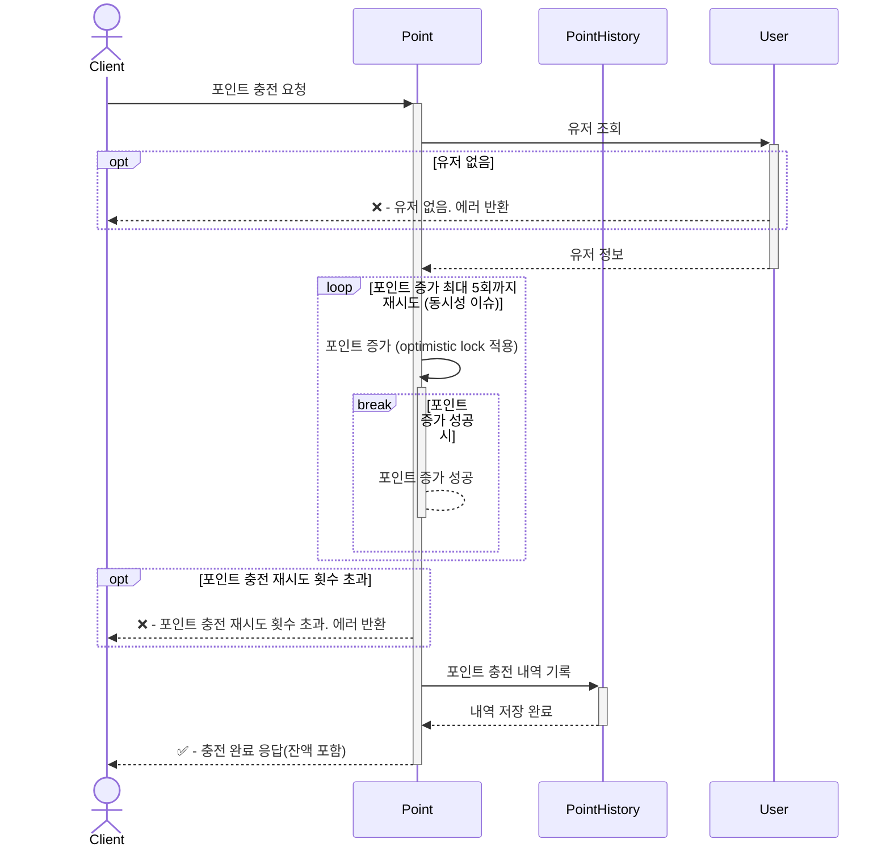
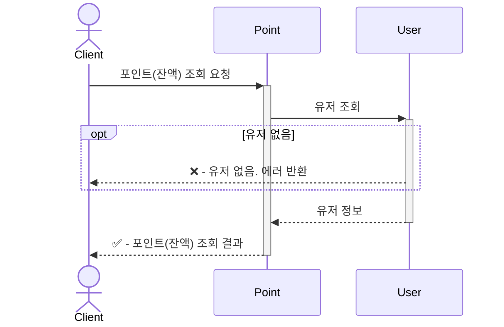
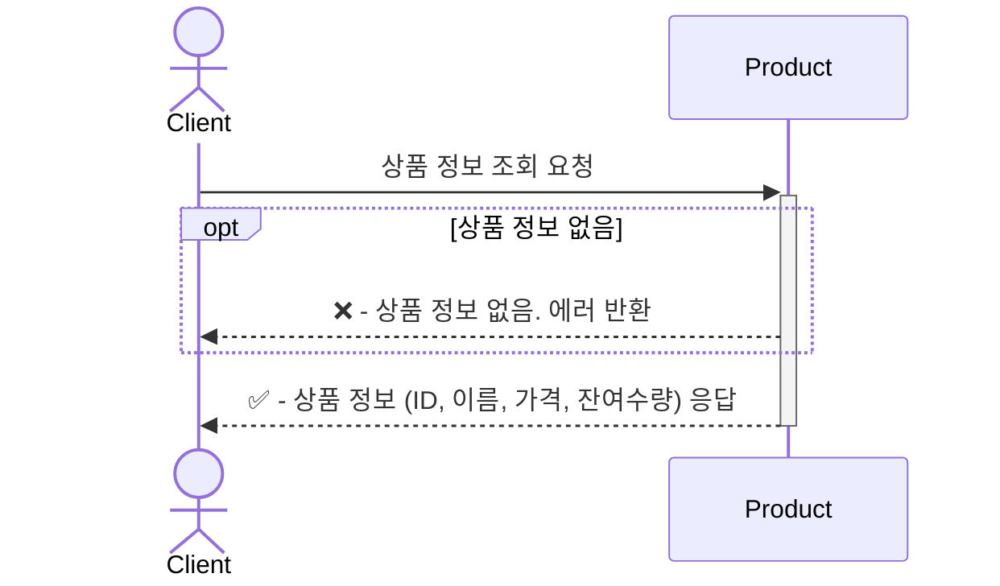
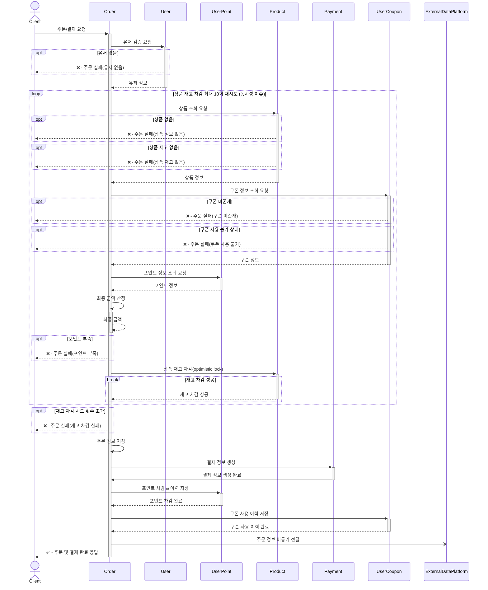
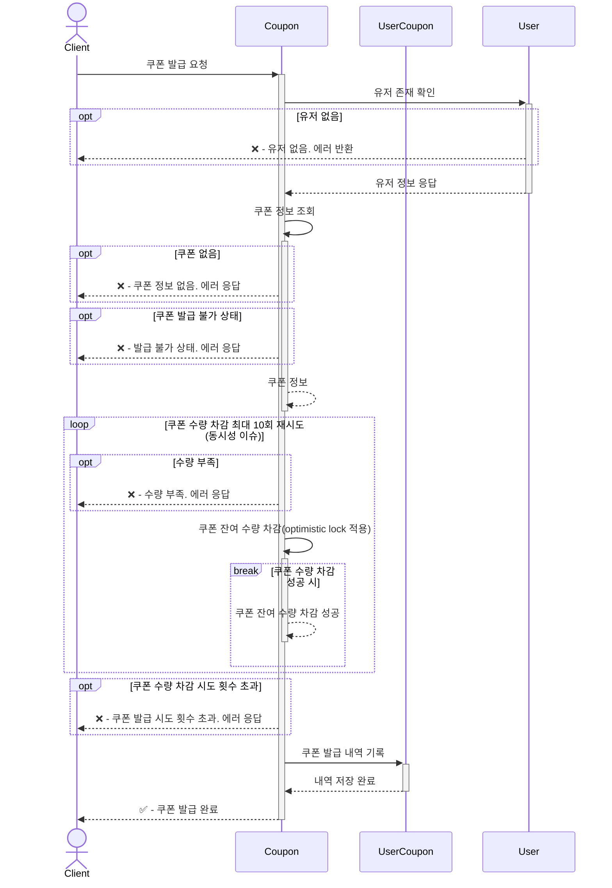
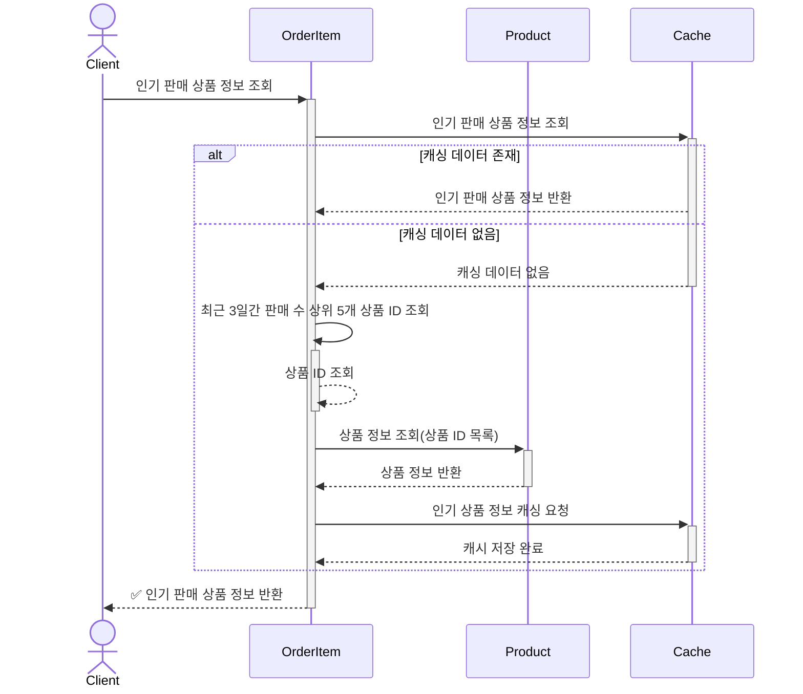

# 시퀀스 다이어그램
- 클라이언트와 도메인 기반으로 다이어그램 작성
- 동시성 이슈 처리에 대한 내용은 비교적 간단한 DB 단에서의 Optimistic Lock 을 사용하는 것을 전제. 
    - 트래픽 규모에 따라 변경될 가능성 있음 (e.g. Redis, Message Queue 등)

## 포인트(잔액) 충전

## 포인트(잔액) 조회

## 상품 조회

## 주문/결제

> 구매할 상품을 미리 주문서에 넣어두는 API 와 결제를 별도로 처리하는 API 를 구분하여 동시성 이슈를 분산시키려 했으나 
> 시스템이 복잡해질 것을 우려해 하나의 API 동작(트랜잭션) 내에서 처리하는 것을 선택했습니다.  
> (대신 하나의 트랜잭션이 복잡해지는 결과 발생)

## 선착순 쿠폰 발급

## 인기 판매 상품 조회

